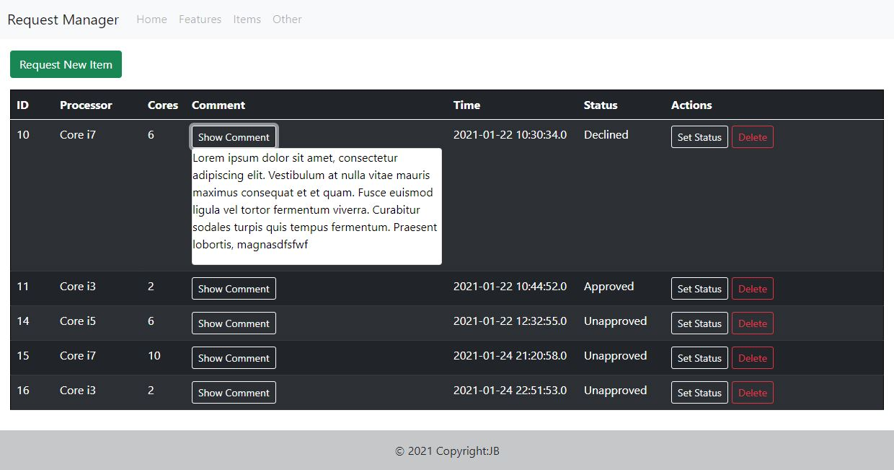

# Request Manager web app using Springboot

Overview
--------
This is a simple Java web application that displays item requests using Spring Boot framework. The main page retrieves and displays all items from database, has an option to edit specific field and delete an entry, as well as a button to open a new page where to provide fields for a new entry.
--------

--------
For this project I have used Eclipse IDE (JavaSE-11), XAMPP (MySQL), Atom (Bootstrap) and Postman. This is a test assignment where I had to develop a web system that allows to request new items. It has to be able to display data from database (MySQL), has to have an option to add a new entry (with some fields as select options), each entry has to have: name, parameter, comment, timestamp fields.
The task had to be done primarily using Java.

To run it on your IDE download and unzip, then import as existing Maven Project. Make necesary changes to application.properties (depending what type of database you use and other changes) as well as review pom.xml (you might need new dependencies). Add the request_items.sql to your database (table path test/request-items.sql). After everything is set up run RequestManagerApplication.java as a java application.

Improvements needed:

0) Add exeption handling;
1) Improve front-end structure: css and js (as of first commit, it has no seperate css, js files, just plain html with Bootstrap);
2) Work on improving front-end features: resizing elements for different screen sizes and other.
